# Deploy Flexdashboard on Github Pages with Github Actions and Docker

 Work in progress, pre-spelling check...


This repo provides a step-by-step guide and a template for deploying and refreshing a [flexdashboard](https://pkgs.rstudio.com/flexdashboard/) dashboard on [Github Pages](https://pages.github.com/) with [Docker](https://www.docker.com/) and [Github Actions](https://github.com/features/actions).

<a href='https://github.com/RamiKrispin/coronavirus_dashboard'>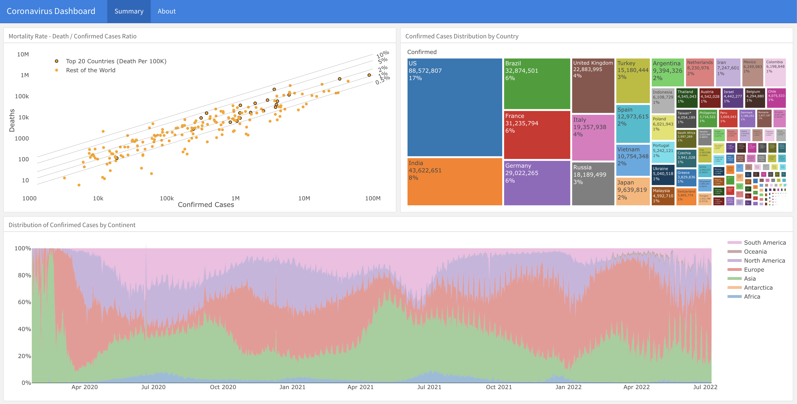</a> 

## TODO
- Set docker environment ✅ 
- Set Github Pages workflow ✅ 
- Build an example dashboard ✅ 
- Set automation with Github Actions
- Create documentations ✅ 
- Add prerequisites ✅
- Environment variables setting ✅
- Add VScode settings.json file 
- Add Github codespace setting
- Add Twitter updates

## Prerequisites

This tutorial was built under the assumption that no previous (or minimum) experience with Docker. While it covers some of the basics of Docker that will help you deploy a flexdashboard with Docker, it is not a Docker tutorial. I highly recommend checking the following tutorials:

- [Docker Tutorial for Beginners](https://www.youtube.com/watch?v=3c-iBn73dDE&t=5409s&ab_channel=TechWorldwithNana) by TechWorld with Nana
- [Docker Tutorial for Beginners - A Full DevOps Course on How to Run Applications in Containers](https://www.youtube.com/watch?v=fqMOX6JJhGo&t=6927s&ab_channel=freeCodeCamp.org) by Moonshot (via freeCodeCamp)
- [Docker Tutorial for Beginners](https://www.youtube.com/watch?v=p28piYY_wv8&t=1534s&ab_channel=Amigoscode) by Amigoscode 

Those tutorials focus on a general introduction to Docker. I also recommend watching the [Docker for R users](https://www.youtube.com/watch?v=oehhZ98o6Zk&t=1077s&ab_channel=useR%21Conference) by [Rahul Sangole](https://github.com/rsangole) and myself, from the useR! 2022 conference.

### General requirements

To run this tutorial, you will need the following requirements:
- Install [Docker Desktop](https://www.docker.com/products/docker-desktop/)
- Have a [Docker Hub](https://hub.docker.com/) account
- Have a [Github](https://github.com) account
- Set some environment variables
- Either [RStudio Desktop](https://www.rstudio.com/products/rstudio/) (preferred) or [VScode](https://code.visualstudio.com/) IDE 


### Installing Docker Desktop

To install Docker Desktop, go to [Docker Desktop](https://www.docker.com/products/docker-desktop/) and follow the installation instructions based on your OS. 

**Note:** Different OS (i.e., Linux, Mac, Windows) may have different system requirements. The requirements information by OS are available on the Docker Desktop [documentation](https://docs.docker.com/desktop/) under the install section.

### Docker Hub

The Docker Hub is the "Github" of container images. It enables you to store your container images and pull and use other users' containers. To register and create an account go to https://hub.docker.com and follow the registration instructions. 

After installing Docker Desktop and setting account on Docker Hub, open on your machine Docker Desktop, and from the commend line login to Docker Hub:

``` shell
 docker login
```

For the login, you will have to enter your user name and password, and should expect the following output if the login was successful:

``` shell
Login with your Docker ID to push and pull images from Docker Hub. If you don't have a Docker ID, head over to https://hub.docker.com to create one.
Username: rkrispin
Password:
Login Succeeded

Logging in with your password grants your terminal complete access to your account.
For better security, log in with a limited-privilege personal access token. Learn more at https://docs.docker.com/go/access-tokens/
```


### Setting environment variables

We will use in this tutorial the following environment variables:
- `FLEX_IMAGE` - The development image name, if you are using the tutorial image it should be set as `rkrispin/flex_dash_env:dev.0.0.0.9000`. Otherwise, set it to the one you plan to use
- `TUTORIAL_WORKING_DIR` - The path for the tutorial folder (e.g., the cloned repository). This variable will be used to bind your Docker container with your local machine. This will be mainly relevant if you are using the RStudio server as your working IDE
- `RSTUDIO_CONFIG_PATH` - The path for the local RStudio config folder. Typically it would be your home directory + `.config/rstudio`. This variable will be used to bind your  


## Folder structure

``` shell
.
├── README.md
├── _site.yml
├── data
├── dev
├── diagrams
├── docker
├── docker-compose.yml
├── docs
├── images
└── index.Rmd
```

## Motivation

As its name implies, the flexdashboard package provides a flexible framework for creating dashboards. It is part of the [Rmarkdown](https://rmarkdown.rstudio.com/) ecosystem, and it has the following features:
* Simple
* Set the dashboard layout with the use of [rows and columns format](https://pkgs.rstudio.com/flexdashboard/articles/layouts.html)
* Customize the dashboard theme using CSS or the [bslib](https://pkgs.rstudio.com/flexdashboard/articles/theme.html) package
* Use built-in widgets such as [value boxes](https://pkgs.rstudio.com/flexdashboard/articles/using.html#value-boxes) and [gauges](https://pkgs.rstudio.com/flexdashboard/articles/using.html#gauges)
* Create interactive (and serverless) dashboards leveraging R data visualization tools (e.g., Plotly, highcharter, dychart, leaflet, etc.), tables (gt, reactable, reactablefrm, kable, etc.), and [htmlwidges](https://pkgs.rstudio.com/flexdashboard/articles/using.html#html-widgets) tools such as crosstalk.
* Build dynamic dashboards with [Shiny](https://pkgs.rstudio.com/flexdashboard/articles/shiny.html) 

This tutorial will focus on deploying flexdashboard to Github Pages and automating the dashboard data refresh with Github Actions and Docker. Github and Docker offer both enterprise and free tools. Throughout this tutorial, we will leverage the free versions.

## When to use Github Actions?

Github Actions is a CI/CD tool enabling scheduling and triggering jobs (or scripts). In the context of R, here are some useful use cases:
- Package testing - Triggering R CMD Check when pushing new code (see this [example](https://github.com/RamiKrispin/coronavirus/actions/workflows/main.yml)) 
- Data automation - Build data pipelines with [Rmarkdown](https://ramikrispin.github.io/coronavirus/data_pipelines/covid19_cases.html) or pull data from [APIs](https://github.com/RamiKrispin/USelectricity/blob/fe742c8756f885a9cbb6dcc9bcf24e1e1ede69ce/.github/workflows/main.yml#L19)
- Refresh data, rerender flexdashboard and redeploy on Github Pages (see [coronavirus](https://ramikrispin.github.io/coronavirus_dashboard/) and [covid19italy](https://ramikrispin.github.io/italy_dash/) packages supporting dashboards)

## Why Docker?

Docker is a CI/CD tool that enables seamless code deployment from dev to prod. By creating OS-level virtualization, it can package an application and its dependencies in a virtual container. Or in other words, the code that was developed and tested in the dev env will run with the exact same env (e.g., the same OS, compilers, packages, and other dependencies) on prod. Docker can run natively on Linux systems and with Docker Desktop (or equivalent) on macOS and Windows OS.

## Docker + R = ❤️❤️❤️

Docker is a great tool for automating tasks in R, in particular, when deploying R code with Github Actions (e.g., R CMD Check, Rmarkdown, Quarto, or Flexdashboard). In this tutorial, we will build a development environment and use it to build the dashboard and then leverage it to deploy it on Github Actions. There are two main approaches for developing with Docker in R:
- RStudio server 
- VScode

We will cover the two and discuss the pros and cons of each approach.

## Workflow

A typical workflow will include the following steps

- **Scope** - define the project requirements and derive dependencies
- **Prototype** - transform the scope into a sketch
- **Dockerize** - set initial development environment 
- **Develop** - build the dashboard functionality and data visualization
- **Deploy** - push the dashboard to Github Pages 
- **Automate** - build the dashboard refresh with Github Actions

Typically, you may update the Docker image throughout the development process if additional requirements (or dependencies) beyond the scope will be needed.

## Dashboard scope

Create a worldwide COVID19 tracker which will include:
- Distribution of confirmed cases by continent
- Cases distribution by country:
    - Confirmed
    - Death

Expected dependencies:
- Dashboard - [flexdashboard](https://pkgs.rstudio.com/flexdashboard/index.html)
- Data - [coronavirus](https://github.com/RamiKrispin/coronavirus)
- Data visualization - [highcharter](https://jkunst.com/highcharter/index.html)
- Utility - [dplyr](https://dplyr.tidyverse.org/), [tidyr](https://tidyr.tidyverse.org/), [lubridate](https://lubridate.tidyverse.org/)

## Dashboard prototype

After setting a clear scope, I found it useful to prototype and put your thoughts on a piece of paper, [drow.io](https://www.diagrams.net/), iPad, or any other tool you find useful. The goal is to translate the scope into some sketches to understand the data inputs, required transformation, type of visualization, etc. In addition, a narrow scope with a good prototype will potentially save you some time and cycles when starting to code the dashboard. That being said, you should stay open-minded to changes in the final output, as what may look nice on the sketch may turn out less appealing on the final output. 


<br>
As the focus of this tutorial is on the deployment itself and not on the data visualization, we will keep the dashboard simple and create the following three plots:

- Daily new cases (either by continent or worldwide), using scatter plot with trend line
- Daily death cases (either by continent or worldwide), using scatter plot with trend line
- Distribution of cases by country using treemap plot

We will leverage the [highcharter](https://jkunst.com/highcharter/index.html) package to create those plots.

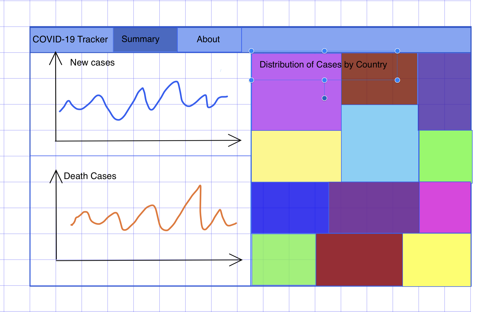

<br>

Once we have defined the scope and have a simple prototype, we better understand the dashboard requirements (e.g., data, packages, etc.), and we can start thinking about the dashboard's general architect. The below diagram describes the general workflow we will use to create the dashboard:

- **Data source** - coronavirus package
- **Orchestration** - Github Actions
- **Environment** - Docker
- **Deployment** - Github Pages 

<br>


<br>

# Set Docker environment

There are multiple approaches for setting a Docker environment with the [Dockerfile](https://docs.docker.com/engine/reference/builder/). My approach is to minimize the `Dockerfile` by using utility files and automating the process with `bash` scrip. This makes the `Dockerfile` cleaner, yielding a smaller image size with fewer layers. Below is the tree of the `docker` folder in this tutorial:

``` shell
.
├── Dockerfile
├── build_docker.sh
├── install_packages.R
├── install_python.R
├── install_quarto.sh
└── packages.json
```

This includes the following four files:
- `Dockerfile` - the image manifest provides a set of instructions for the docker engine about how to build the image
- `build_docker.sh` - a bash script to automate the build of the image and push to Docker Hub
- `install_packages.R` - an R script that installs the dependencies of the project as set in the `packages.json` file
- `install_packages.R` - an R script that installs the Python dependencies of the project as set in the `packages.json` file
- `install_quarto.sh` - a Bash script that install Quarto
- `packages.json` - a JSON file with a list of the project packages and their version

Before diving into more details, let's review the `Dockerfile`.

## The Dockerfile

The `Dockerfile` provides a set of instructions for the docker engine to build the image. You can think about it as the image's recipe. It has its own unique and intuitive syntax following this structure:

``` dockerfile
COMMAND some instructions
```

Docker can build images automatically by reading the instructions from a Dockerfile. In this tutorial, we will use the following `Dockerfile`:

``` Dockerfile
# Pulling Rocker image with RStudio and R version 4.2
FROM rocker/rstudio:4.2

# Setting environment variables
ARG CONDA_ENV=flex_dashboard
ENV CONDA_ENV=$CONDA_ENV

ARG PYTHON_VER=3.8
ENV PYTHON_VER=$PYTHON_VER

ARG QUARTO_VERSION=1.1.149
ENV QUARTO_VERSION=$QUARTO_VERSION

# Disabling the authentication step
ENV USER="rstudio"
CMD ["/usr/lib/rstudio-server/bin/rserver", "--server-daemonize", "0", "--auth-none", "1"]

# Install jq to parse json files
RUN apt-get update && apt-get install -y --no-install-recommends \
    jq \
    libxml2-dev \
    zlib1g \
    g++-11 \
    libz-dev \
    freetype2-demos \
    libpng-dev \
    libtiff-dev \
    libjpeg-dev \
    make \
    fontconfig \
    libfribidi-dev \
    libharfbuzz-dev \
    libfontconfig1-dev \
    && rm -rf /var/lib/apt/lists/*

# installing R packages
RUN mkdir packages
COPY install_packages.R packages/
COPY install_python.R packages/
COPY packages.json packages/
RUN Rscript packages/install_packages.R

# Installing Quarto
COPY install_quarto.sh packages/
RUN  bash packages/install_quarto.sh $QUARTO_VERSION


# Install miniconda
RUN sudo apt update && apt-get install -y --no-install-recommends \
    software-properties-common \
    && sudo add-apt-repository -y ppa:deadsnakes/ppa \
    && sudo apt update 

RUN wget --quiet https://repo.anaconda.com/miniconda/Miniconda3-latest-Linux-x86_64.sh -O ~/miniconda.sh \
    && /bin/bash ~/miniconda.sh -b -p /opt/conda \
    && export PATH=/opt/conda/bin:$PATH \
    && conda init bash \
    && conda install conda-build

# Set environment
RUN . /root/.bashrc \
    && conda create -y --name $CONDA_ENV python=$PYTHON_VER 

RUN echo "conda activate $CONDA_ENV" >> ~/.bashrc
RUN Rscript packages/install_python.R

EXPOSE 8787
```
The above Dockerfile has the following components:
- **Base image** - We will use the [rocker/rstudio:4.2`](https://hub.docker.com/r/rocker/rstudio/tags) image as the base image for this project. This image contains R version 4.2.0 and the RStudio server installed and will be used as the development environment.
- **Setting arguments and environment variables** - We will use the `ARG` argument to set the build arguments and the `ENV` argument to set the environment variables. The main distinction between the `ARG` and the `ENV` arguments:
    - The `ARG` argument enables the user to assign variables dynamically during the build time. 
    - The `ENV` argument enables to set of environment variables that are available both during the build and run time (as opposed to `ARG`s variables that are available only during the build time).
    - One way to set dynamic environment variables is to set them first as arguments and then assign them to environment variables. Not sure if this is the best practice, but it is a convenience to have some of the arguments available after the build time, mainly for debugging.

    To run R in VScode, we will use [radian](https://github.com/randy3k/radian), an alternative R console with multiline editing and rich syntax highlight. The radian is Python based therefore, we will set Conda to set a Python environment. The `CONDA_ENV` and `PYTHON_VER` will be used to set the Conda environment and its version. In addition, we will use the `QUARTO_VERSION` argument to set the Quarto version.

- **Disabling the authentication** - By default, the RStudio server requires a user name and password. We will use the `ENV` command to define the environment variable `USER` and set it as `rstudio` and the `CMD` command to disable the authentication step.
- **Installing Dependencies** - Generally, rocker images will have most of the Debian packages, C/C++ compliers, and other dependencies. However, often you may need to install additional requirements based on the packages you add to the image. In our case, we will use the `RUN` command to install [jq](https://stedolan.github.io/jq/), a command line tool for parsing `JSON` files, and the [libxml2](https://packages.debian.org/search?keywords=libxml2) Debian package that is required to install the [lubridate](https://lubridate.tidyverse.org/) package.
- **Installing the R packages** - To install additional R packages, we will make a new directory inside the image called `packages` and copy the `install_packages.R` and `packages.json` files that will be used to install the required R packages. 
- **Install Quarto** - We will use the `install_quarto.sh` bash script to install Quarto. We will use the `QUARTO_VERSION` argument to set the version (1.1.149).
- **Set Python Environment** - We will set Python environment with Conda and than install [radian](https://github.com/randy3k/radian). We will set Python environment with Conda and then install [radian](https://github.com/randy3k/radian). This step requires if you are planning to develop with VScode (or down the road when [flexdashboard](https://quarto.org/docs/faq/rmarkdown.html#i-use-x-bookdown-blogdown-etc..-what-is-the-quarto-equivalent) will be available for Python, [Julia](https://julialang.org/), and [Observable](https://observablehq.com/) with [Quatro](https://quarto.org/))
- **Expose port** - Last but not least, we will use the `EXPOSE` command to expose port 8787 (default) for the RStudio server (as set on the base docker).

We will define all required packages and their versions on the `packages.json` file:

``` json
{
    "packages": [
        {
            "package": "cpp11",
            "version":"0.4.2"
        },
        {
            "package": "flexdashboard",
            "version":"0.5.2"
        },
        {
            "package": "dplyr",
            "version":"1.0.9"
        },
        {
            "package": "tidyr",
            "version":"1.2.0"
        },
        {
            "package": "highcharter",
            "version":"0.9.4"
        },
        {
            "package": "readr",
            "version":"2.1.2"
        },
        {
            "package": "coronavirus",
            "version":"0.3.32"
        },
        {
            "package": "lubridate",
            "version":"1.8.0"
        },
        {
            "package": "languageserver",
            "version":"0.3.13"
        }
        
       
    ],
    "debug_mode": [
        {
            "package": "ragg",
            "version":"1.2.2"
        }
    ],
    "python_packages": [
        {
            "package": "radian",
            "version": "0.6.3"
        }
    ]
}

```

Note that the JSON file has three sections:

- `packages` - Defines the R packages to install from CRAN (or CRAN archive)
- `debug` - used when some packages "refused" to get installed and enables a quick debugging mode to track the error (or identify which Debian packages are missing...)
- `python_packages` - defines the Python packages to install on the conda environment


To build the Docker image, we will use `build_docker.sh` file, which builds and push the image to Docker Hub:

``` bash
#!/bin/bash

echo "Build the docker"

docker build . --progress=plain \
               --build-arg QUARTO_VERSION=1.1.149 \
               --build-arg CONDA_ENV=flex_dashboard \
               --build-arg PYTHON_VER=3.8 \
               -t rkrispin/flex_dash_env:dev.0.0.0.9000

if [[ $? = 0 ]] ; then
echo "Pushing docker..."
docker push rkrispin/flex_dash_env:dev.0.0.0.9000
else
echo "Docker build failed"
fi
```

This `bash` script simply builds the docker and tags it as `rkrispin/flex_dash_env:dev.0.0.0.9000`, and then, if the build was successful, push it to Docker Hub. As you can see on the `docker build` command, we are using the `--build-arg` argument to define the `Dockerfile` arguments. To execute this script from the command line:

```shell
bash build_docker.sh
```

## Lunching the development environment

We will review two approaches to setting a development environment using:
- RStudio server
- VScode

Of the two, when working with flaxdashboard, RStudio is the preferred choice. There are some advantages to developing with VScode, mainly when working in a dockerized environment and multiple languages. On the other hand, it is less suitable to work with Rmarkdown documents such as flexdashboard.

### Setting environment with RStudio server

There are multiple methods to spin a docker image into a running containter. Before going to the robust method using the `docker-compose`, let's review the basic method with the `run` command:

``` shell
docker run -d -p 8787:8787 rkrispin/flex_dash_env:dev.0.0.0.9000
```

The `docker run` command (or `run` in short) enables you to launch a container. In the above example, we used the following arguments:
* `-d` (or detach mode) to run the container in the background and 
* `-p` argument maps between the container and the local machine ports, where the right to the `:` symbol represents the port that is exposed on the container and the one on the left represents the port on the local machine. In the above example, we mapped port 8787 on the docker to port 8787 on the local machine

We close the `run` command with the name of the image we want to launch.


**Note:** If you got the following error, check if your Docker desktop is open:

``` shell
docker: Cannot connect to the Docker daemon at unix:///var/run/docker.sock. Is the docker daemon running?.
See 'docker run --help'.
```

If the image is unavailable locally, it will try to pull it from the default hub (make sure you logged in, it might take a few minutes to download it). If the image was successfully launched, it should return the container ID, for example:

``` shell
ac26ec61e71bc570a2ed769ba2b0dbef964d536f7d7cc51b61ea3e8542953cb1
```

You can use the `docker ps` command to check if the image is running:
``` shell
docker ps

CONTAINER ID   IMAGE                                   COMMAND                  CREATED         STATUS         PORTS                    NAMES
ac26ec61e71b   rkrispin/flex_dash_env:dev.0.0.0.9000   "/usr/lib/rstudio-se…"   4 minutes ago   Up 4 minutes   0.0.0.0:8787->8787/tcp   sweet_elion
```

Now you can go to your browser and use `http://localhost:8787` to access the Rstudio server from the browser:

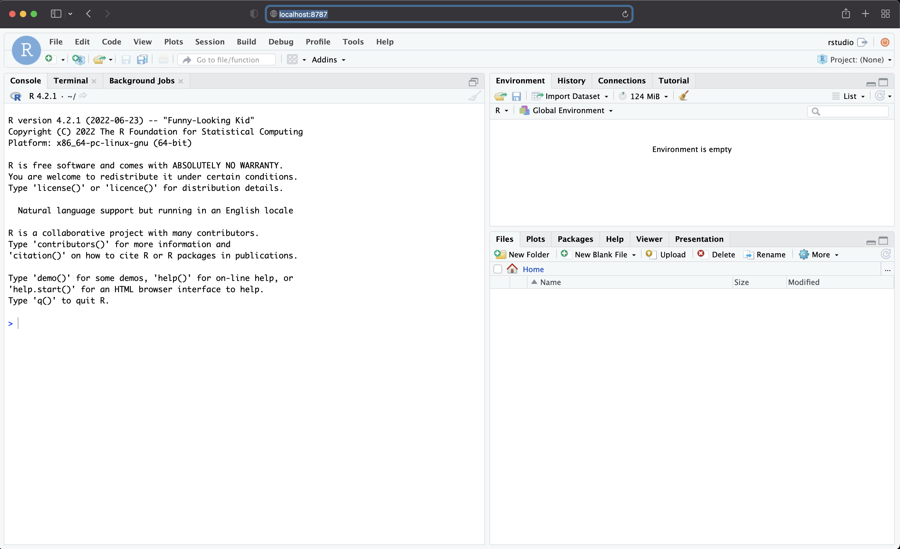

<br>

Does it sufficient to start developing our dashboard? The answer is **NO**! 

<br>

We have a functional environment, yet we are still missing a couple of elements to make this container fully functional as a development environment. For example, although we can access the container from the browser, it is still an isolated environment as we can't save or commit changes in the code. Let's add the `-v` argument to mount a local volume with the container. This will enable you to work inside the container and read and write data from your local machine. If the container is already running, use the `docker kill` (yes, not the best wording for a command...) following by the container ID (see the `docker ps` output for the container ID) to stop the running containers:

``` shell
docker kill ac26ec61e71b
```
Let's repeat the previous command and add the `-v` argument to mount the container to your local folder:

```shell
docker run -d -p 8787:8787 -v $TUTORIAL_WORKING_DIR:/home/rstudio/flexdash rkrispin/flex_dash_env:dev.0.0.0.9000
```

You can see now, after applying and refreshing the container, that the `flexdash` folder (marked with a green rectangle) is now available inside the container:


Note that `$TUTORIAL_WORKING_DIR` is the environment variable that I set with the local folder path on my machine, and `/home/rstudio/` is the root folder on the container, and `flexdash` is the name of the mounted folder inside the container. To run it on your local machine, you should modify in the following example `YOUR_LOCAL_PATH` with your folder local path and `FOLDER_NAME` with the name you want to use for this mount volume inside the container:

``` shell
docker run -d -p 8787:8787 -v YOUR_LOCAL_PATH:/home/rstudio/FOLDER_NAME rkrispin/flex_dash_env:dev.0.0.0.9000
```

Does it sufficent to start develop our dashboard? Technicly, yes, we can now develop and text our code inside the container and save the changes on the local folder (and commit the changes with `git`).  But before we continue, let's mount our local RStudio config file with the one on the container. This will  mirror your local RStudio setting to the RStudio server running inside the container:

``` shell
docker run -d -p 8787:8787 \
 -v YOUR_LOCAL_PATH:/home/rstudio/FOLDER_NAME \
 -v $RSTUDIO_CONFIG_PATH:/home/rstudio/.config/rstudio \
 rkrispin/flex_dash_env:dev.0.0.0.9000
```

Now, I have inside the container the same setting (e.g., color theme, code snippets, etc.):

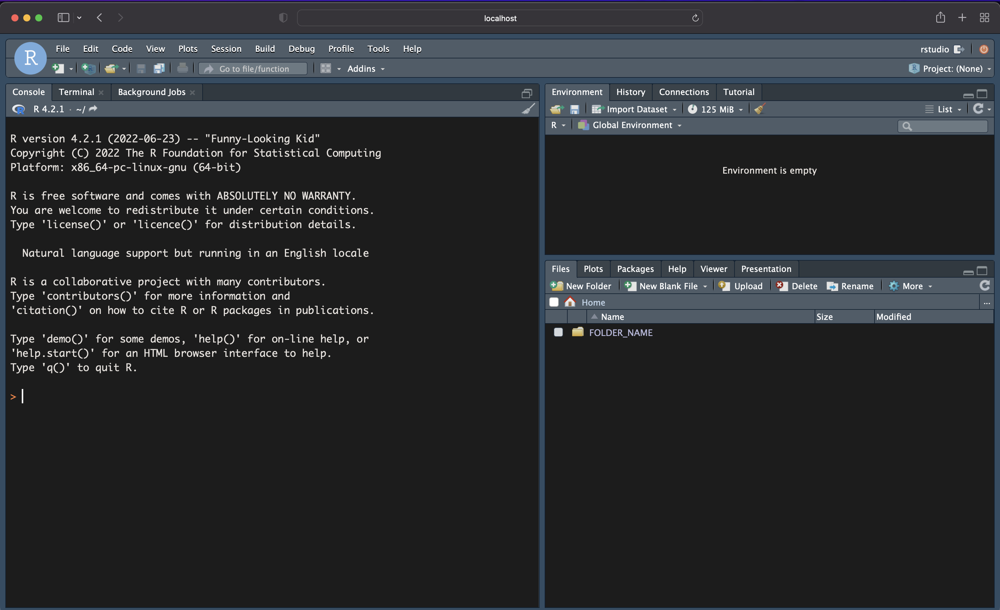

**Note:** Your local R setting file should be, by default, under your root folder, for example, the path on my machine - `/Users/ramikrispin/.config/rstudio`.

As you add more elements to the `docker run`, it becomes convoluted to run it each time you want to spin the container. The `docker-compose` command provides a more concise method to launch a docker container using the `docker-compose.yml` file to set the docker run arguments and use the `docker-compose up` command to launch to the container (and `docker-compose down` to turn it off). Following the above example, here is how we customize those options with `docker-compose`: 

`docker-compose.yml`:
``` bash
version: "3.9"
services:
  rstudio:
    image: "$FLEX_IMAGE" 
    ports:
      - "8787:8787"
    volumes:
      - type: "bind"
        source: "$TUTORIAL_WORKING_DIR"
        target: "/home/rstudio"
      - type: "bind"
        source: "$RSTUDIO_CONFIG_PATH"
        target: "/home/rstudio/.config/rstudio"
```

Once you understand how `docker run` is working, it is straightforward to understand, set, and modify the above `docker-compose.yml` file according to your needs. As before, we set the image, ports, and volumes in the corresponding sections of the `yaml` file. Note that I am using three environment variables to set the docker image (`FELX_IMAGE`), the local folder to mount (`TUTORIAL_WORKING_DIR`), and the RStudio config file (`RSTUDIO_CONFIG_PATH`). Typically, this file is saved on the project/repository root folder. To launch the docker, from the path of the file, run on the command line:

``` shell
docker-compose up -d
```
Like before, we added the detach argument `-d` to keep the terminal free after launching the container. When you are done with the container, you can turn it off by using:

``` shell
docker-compose down
```


### Setting environment with VScoce

The main advantage of VScode is the seamless integration with Docker. While it is a great development framework when working with multiple languages (e.g., R, Python, bash, etc.) and setting Dockerfiles, on the other hand, it is not the ideal development environment when working with flexdashboard. That might change in the future with Quarto.

**Setting**

To set containerized environment with VScode, we will create the `devcontainer.json` file under the `.devcontainer` folder. The `devcontainer.json` has the functionality of the `docker-compose.yml` file, and it provides to VScode a set of instructions about the Docker environment. This is the `devcontainer.json` we will use in this project:

``` JSON
{
    "name": "flexdashboard-development",
    "image": "${localEnv:FLEX_IMAGE}",
    "customizations": {
        "vscode": {
            "settings": {
                "python.defaultInterpreterPath": "/opt/conda/envs/flex_dashboard/bin/python"
            },
            "extensions": [
                "quarto.quarto",
                "ms-azuretools.vscode-docker",
                "ms-python.python",
                "rdebugger.r-debugger",
                "ms-vscode-remote.remote-containers",
                "yzhang.markdown-all-in-one",
                "reditorsupport.r",
                "redhat.vscode-yaml",
                "REditorSupport.r",
                "REditorSupport.r-lsp", 
                "RDebugger.r-debugger" 
            ]
        }
    },
    "mounts": [        
        "source=${localEnv:TUTORIAL_WORKING_DIR},target=/home/,type=bind,consistency=cache"],
    "remoteEnv": {
        "VAR1": "TEST1",
        "VAR2": "TEST2"
    },
    "postCreateCommand": "radian"
}
```

**Key arguments:**

- `name` - defines the environment name
- `image` - defines the image that will be used for the environment. Similar to the `docker-compose.yml`, we will use the `FLEX_IMAGE` environment variable to set the image name
- `python.defaultInterpreterPath` under the setting argument is used to define the default Python path for the Python interpreter. We will use the conda environment we set on the Dockerfile (`flex_dashboard`) as the default.
The extensions section, as the name implies, defines the environment extensions
- `mount` - enables binding between the local folders and those inside the docker. The nice thing about VScode is that you don't need to mount your project folder with the container. As example, I mount the local folder (using the TUTORIAL_WORKING_DIR environment variable) with the home directory inside the Docker.
- `remoteEnv` - can be used to set environment variables. As example, I set two environment variables `VAR1` and `VAR2`
- `postCreateCommand` - set the command to run after the launch of the container is done. In the case above, we set `radian` to be the default.

**Open the folder inside a container**

Once the `.devcontainer.json` file is ready, it is straightforward to open the folder inside a container. Let's start by opening the project folder - on the main menu, go to `File` -> `Open Folder...`, and select the project folder. In the screenshot below, you can see the project folder marked with a blue rectangle:

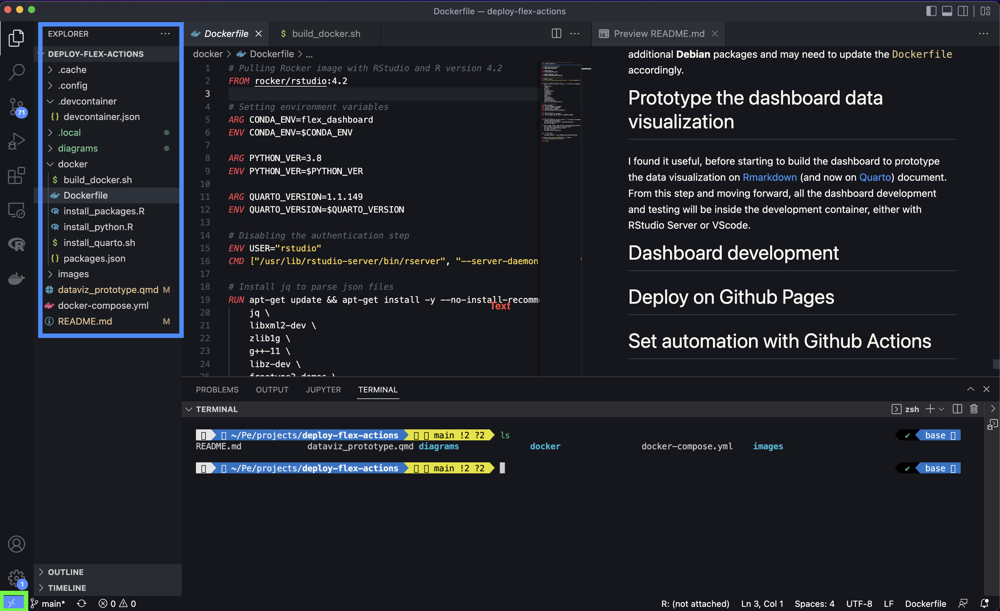

The next step is to click on the `><` symbol (marked with the green rectangle) on the bottom left corner, which will open a menu on the top of the screen, and select the `Reopen in Container` option.

You can test your environment by opening the terminal. You should expect to see a similar view as in the screenshot below (depending on your setting). The Conda environment name that you logged in is in the brackets (e.g., `flex_dashboard` marked in purple). If you type `radian` or `r`,  it will open the default R console with **radian** (marked with green). In addition, you can see at the bottom the project name as defined on the `devcontainer.json` file (marked in yellow) and the branch name (marked in blue).


Last but not least, if you make any changes in the image, you will have to refresh the environment by selecting the `Rebuild Container` option (click on the `><` symbol to open the container menu).

## Castumize the image

If the above packages (in the `packages.json` file) meet your requirements, then you are good to go and start to develop (with minimal effort in setting your global environment variables). If you have additional or different requirements, you can update the `packages.json` file according to your environment requirements and re-build the docker image using the `build_docker.sh` file. The only caveat for this is that for some packages, you may need to install additional **Debian** packages and may need to update the `Dockerfile` accordingly.


# Code prototype

I found it useful to create the dashboard plots based on the scope and prototype steps just before starting to build the dashboard. This enables you to prepare the data, test, and customize your ideas from the prototype step. I typically use a  [Rmarkdown](https://rmarkdown.rstudio.com/) (and now on [Quarto](https://quarto.org/)) document for that. The [Quarto doc](https://github.com/RamiKrispin/deploy-flex-actions/blob/main/dev/dataviz_prototype.qmd) I used for this tutorial is under the dev folder.

From this step forward, all the dashboard development and testing will be inside the development container, either with RStudio Server or VScode. I will use RStudio Server for the data visualization code prototype. To launch the container, use the `docker-compose` command:

```shell
docker-compose up -d
```

You should expect the following output:
``` shell
Creating network "deploy-flex-actions_default" with the default driver
Creating deploy-flex-actions_rstudio_1 ... done
```
Now, you can go to your browser and open `http://localhost:8787` to open your RStudio Server inside the development container.

Based on the dashboard scope and prototype plan above, we will need the following data transformation:

- Daily cases (confirmed and death) by country
- Total daily cases (confirmed and death)

For creating those dataset we will use the [coronavirus](https://github.com/RamiKrispin/coronavirus) package, which provides daily snapshot of the John Hopkins COVID19 dataset.

We will use those datasets to generate the following three plots:
- Total cases distribution by country using a treemap
- Plot daily new cases using a time series plot
- Plot daily death cases using a time series plot

After creating the treemap plot, I realized that due to the skewness of the top countries (both percentage and absolute numbers), the use of treemap is less effective:


Looking into the [highcharter](https://jkunst.com/highcharter/index.html) package documentation, I came across the packed bubble chart [example](https://jkunst.com/highcharter/articles/highcharts.html#packedbubble), and decided to use it instead of the treemap:

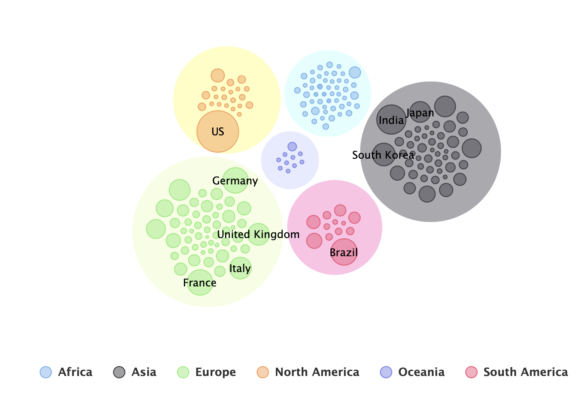

To generate this view, I loaded the GIS codes mapping file from the John Hopkins COVID19 tracker [repository](https://github.com/CSSEGISandData/COVID-19). This table was used to add the continent field.

Next, I used the aggregate cases data to create a time series view of the worldwide daily new cases. I started with this basic plot:

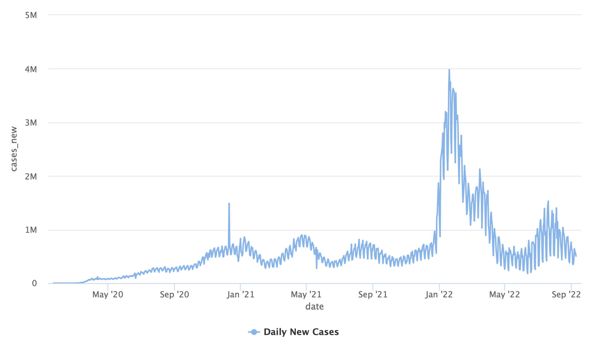

And customized the plot (e.g., add titles, legends, trend line, etc.):


Using the same logic, I create similar plot for the new death cases:

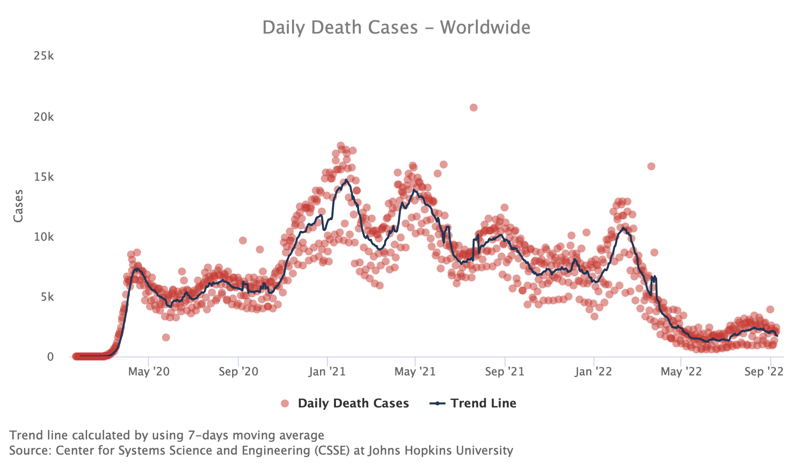


Now that we have the data transformation and plots finalized, we can move to the next step and paste the code on the flexdashboard template.

# Dashboard development

Before we start to build the dashboard, we will have to set the `_site.yml`, which enables us to define the site options. We will use the name and output_dir arguments to define the site name and rendering output-dir, respectively:

``` shell
name: "COVID19 Tracker"
output_dir: docs
```

This will direct the output of the flexdashboard files to the `docs` folder, which will enable to build a site with Github Pages.

## Create new flexdashboard template

It is strightforward to create a new flexdashboard template with RStudio, using the `File` menu and select `New File` and `R markdown...` options:


Next, on the `New R Markdown` window, select `From Template` option and then the `Flex Dashboard` option:

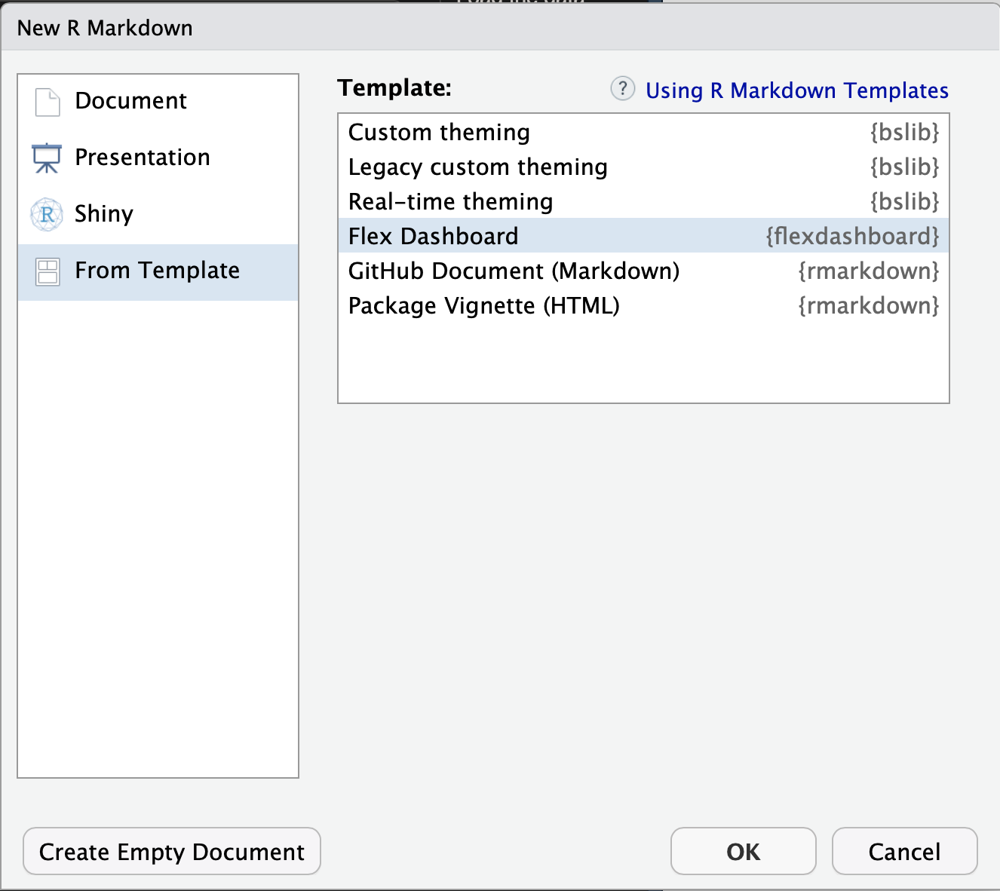

This will generate the following template (showing only the `yaml` header):

``` R
---
title: "Untitled"
output: 
  flexdashboard::flex_dashboard:
    orientation: columns
    vertical_layout: fill
---
```
**Note:** As far as I know, there is now built-in Rmarkdown template in VScode, therefore, if you are using VScode, you can copy the above yaml header to your `Rmd` file.

We will name the template file as `index.Rmd`, which will generate an `index.html` that will be used as the website file.

You can check if you setting of your `_site.yml` file done properly by rendering the file. At the first run it expected to create the `docs` folder and create the website files:

```
.
├── data
├── dev
│   └── dataviz_prototype_files
│       └── libs
│           ├── bootstrap
│           ├── clipboard
│           ├── highchart-binding-0.9.4
│           ├── highcharts-9.3.1
│           │   ├── css
│           │   ├── custom
│           │   ├── modules
│           │   └── plugins
│           ├── htmlwidgets-1.5.4
│           ├── jquery-3.5.1
│           ├── proj4js-2.3.15
│           └── quarto-html
├── diagrams
├── docker
├── images
└── site_libs
    ├── bootstrap-3.3.5
    │   ├── css
    │   │   └── fonts
    │   ├── fonts
    │   ├── js
    │   └── shim
    ├── header-attrs-2.16
    ├── jquery-3.6.0
    └── stickytableheaders-0.1.19

29 directories
```


Once we have the dashboard functionality prototyped on the Quarto doc, it is straightforward to populate the visualization on the dashboard template:

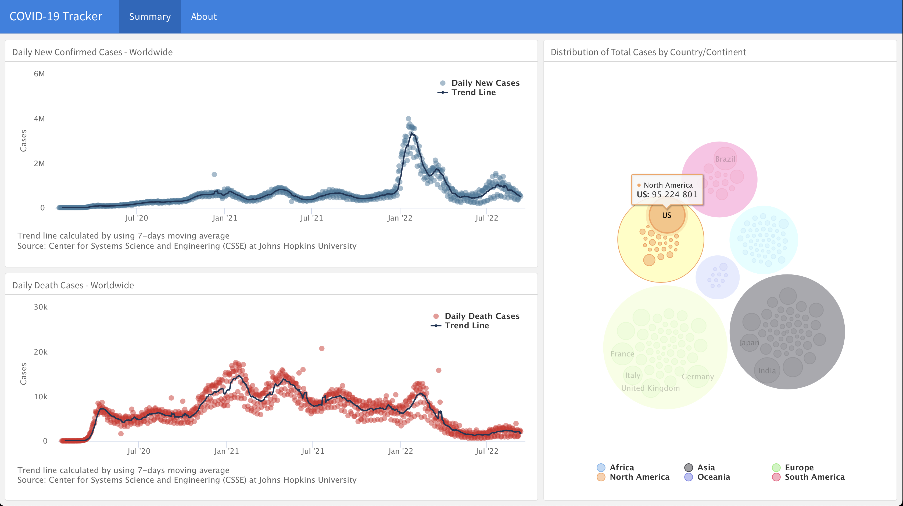

YAY! we have the dashboard set, let's deploy it on Github pages.

# Deploy on Github Pages

By this point, about 95% of the work is done. Setting a Github Page simply required a website files under the docs folder, which we already created. 

## Setting 
On the repo main menu, select the `Settings` (marked in purple) tab and then the `Pages` option (marked in green) to open the Github Pages settings 

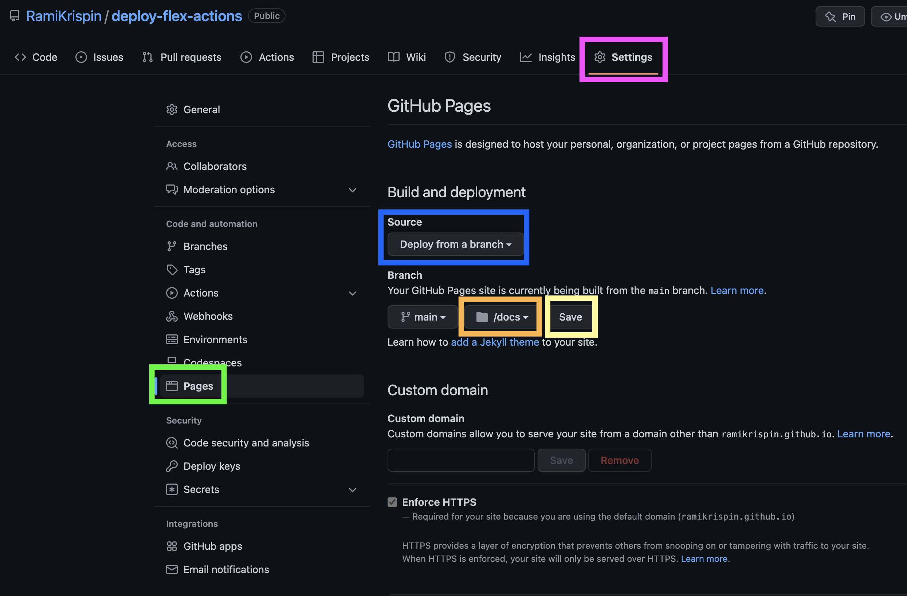

Under the `Source` option (marked in blue) select `Deploy from a branch`, and then select the `docs` folder (marked in orange). Last but not least, click the `Save` button (marked in yellow).

It might take few minutes to Github to render the website and you should see the link for the website on that page (refresh the page if you cannot see it). Github Pages use the following website address patern:

``` shell
https://GITHUB_USER_NAME.github.io/REPO_NAME/
```

In this case the link for this tutorial dashboard is:

https://ramikrispin.github.io/deploy-flex-actions/


Under the `Source` option (marked in blue) select `Deploy from a branch`, and then select the `docs` folder (marked in orange). Last but not least, click the `Save` button (marked in yellow).

It might take a few minutes for Github to render the website, and you should see the link for the website on that page (refresh the page if you cannot see it). Github Pages use the following website address pattern:

```
https://GITHUB_USER_NAME.github.io/REPO_NAME/
```
In this case, the link for this tutorial dashboard is:
https://ramikrispin.github.io/deploy-flex-actions/

# Testing

Before we continue to the automation step with Github Actions, let's test what we have built so far. The main goal of the testing stage is to check the dashboard update step in a similar environment as it would run with Github Actions. Hence, we would render the dashboard inside the container directly from the terminal.

It is always a good practice to restart the container before testing. This will ensure that it will not include any packages you installed during the run time (as opposed to those installed during the build time). To reset the container, let's use the `docker-compose` command:

``` shell
docker-compose down
```
And then relaunch the development environment with:

``` shell
docker-compose up -d
```

You can confirm that your container is up by using the `docker ps` command:

``` shell
docker ps

CONTAINER ID   IMAGE                                   COMMAND                  CREATED         STATUS         PORTS                    NAMES
d594356d8ccc   rkrispin/flex_dash_env:dev.0.0.0.9000   "/usr/lib/rstudio-se…"   3 minutes ago   Up 3 minutes   0.0.0.0:8787->8787/tcp   deploy-flex-actions_rstudio_1
```
Next, let's ssh to the container and open the bash shell on the terminal using the `docker exec` command:

``` shell
docker exec -it d594356d8ccc /bin/bash 
```

Where the `d594356d8ccc` is the container ID, from the `docker ps` output above, and `/bin/bash` defines the type of shell we want to open. This will lead you to the bash terminal inside the container: 

``` shell
(flex_dashboard) root@d594356d8ccc:/# 
```
You can note that the `(flex_dashboard)` represents the conda environment we set, and the `d594356d8ccc` after the `root@` represents the container ID. You can inspect the container root folder with the `ls` command:

``` shell
(flex_dashboard) root@d594356d8ccc:/# ls
bin  boot  dev  etc  home  init  lib  lib32  lib64  libexec  libx32  media  mnt  opt  packages  proc  rocker_scripts  root  run  sbin  srv  sys  tmp  usr  var
```

We can find our local bind folder (as set on the `docker-compose.yml` file) inside the container under the `home/rstudio` folder:

``` shell
(flex_dashboard) root@d594356d8ccc:/# cd home/rstudio/
(flex_dashboard) root@d594356d8ccc:/home/rstudio# ls
bash  data  dev  diagrams  docker  docker-compose.yml  docs  images  index.Rmd  README.md  _site.yml
```

Let's now test the rendering process by calling the Rmarkdown `render_site` command from the terminal with the `Rscript` command:

``` shell
(flex_dashboard) root@d594356d8ccc:/home/rstudio# Rscript -e "rmarkdown::render_site()"
```

To confirm that the dashboard was rendered, go to the `docs` folder and check the time the files were modified last with the `ls -l` command:

``` shell
(flex_dashboard) root@d594356d8ccc:/home/rstudio# cd docs
(flex_dashboard) root@d594356d8ccc:/home/rstudio/docs# ls -l
total 752
drwxr-xr-x  3 root root     96 Sep 17 10:16 bash
drwxr-xr-x  4 root root    128 Sep 17 10:16 data
drwxr-xr-x  7 root root    224 Sep 17 10:16 dev
drwxr-xr-x  4 root root    128 Sep 17 10:16 diagrams
drwxr-xr-x  8 root root    256 Sep 17 10:16 docker
-rw-r--r--  1 root root    306 Sep 17 10:16 docker-compose.yml
drwxr-xr-x 25 root root    800 Sep 17 10:16 images
-rw-r--r--  1 root root 762993 Sep 17 10:16 index.html
drwxr-xr-x 10 root root    320 Sep 17 10:16 site_libs
(flex_dashboard) root@d594356d8ccc:/home/rstudio/docs# date
Sat 17 Sep 2022 10:22:34 AM UTC
```

**Note:** You can also check and confirm the changes from your local folder by using the `git status` command and see changes on the `docs` folder (assuming there were no changes before). Also, make sure you commit those changes before setting the workflow to avoid future git merging conflicts.


# Set automation with Github Actions

By this point, we have an environment set with Docker and a dashboard deployed on [Github Pages](https://ramikrispin.github.io/deploy-flex-actions/). The next step is to set a workflow on Github Actions to set daily refresh of the dashboard to get up-to-date with the data available on the [coronavirus](https://github.com/RamiKrispin/coronavirus) package. 


## What is Github Actions?

TODO ...

## Creating a Github Actions workflow

Let's start with creating a new workflow by opening the Actions tab (marked in yellow on the screenshot below) on the repository's main menu and selecting the `New workflow` button (marked in green).

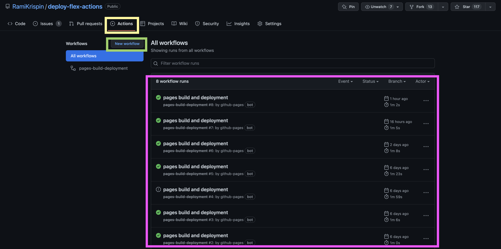

**Note:** The deployment to Github Pages triggered a daily workflow to refresh and deploy the website on Github Pages (marked in purple). Although the name of this action state "build and deploy", it is not refreshing and rendering the dashboard. Therefore we will have to run a dedicated action for that.

In the next step, we will select the type of workflow. There is no specific built-in workflow for our use case. Therefore we will select the set up a workflow yourself (marked in green) option:


Last but not least, we will set the workflow. Github will automatically generate a file named `main.yml` under the folder `.github/workflows/`. For a better context, we will rename the file name to `dashboard_refresh.yml` (marked in yellow) and remove the built-in code example (marked in purple):

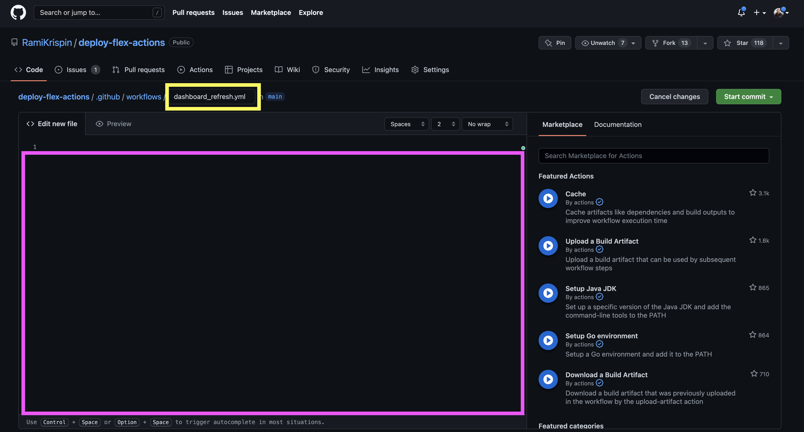


# Next steps

TODO...

# License

This tutorial is licensed under a [Creative Commons Attribution-NonCommercial-ShareAlike 4.0 International](https://creativecommons.org/licenses/by-nc-sa/4.0/) License.